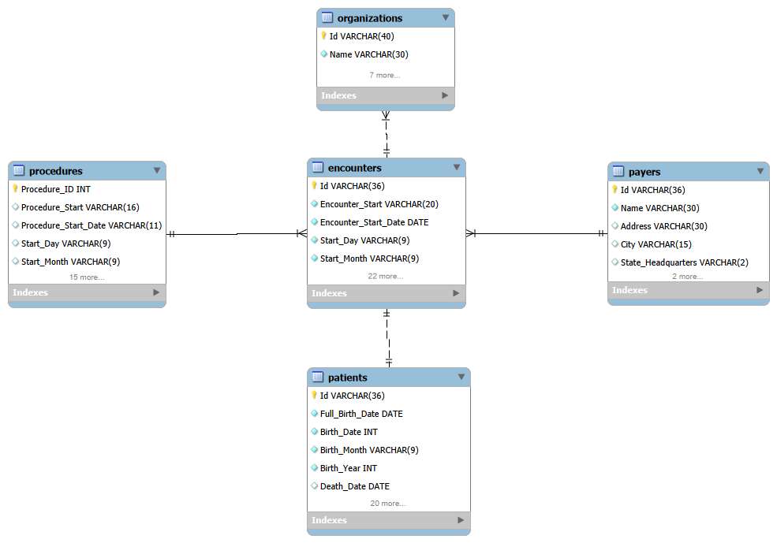

# 🏥 Hospital Data Analysis Using SQL

## 📌 Project Overview

This project analyzes a hospital database containing over **75,000 healthcare records** across **5 relational tables** patient demographics, hospital encounters, medical procedures, insurance providers, and organizational information, representing **974 unique patients** using SQL.

The objective of this project is to transform raw healthcare data into meaningful business insights by designing a relational database, writing analytical SQL queries, and answering real-world operational and financial questions.

The project demonstrates SQL concepts commonly used in Data Analyst roles, including joins, aggregations, window functions, Common Table Expressions (CTEs), subqueries, and conditional logic.

| Feature      |   Value |
| ------------ | ------: |
| Tables       |       5 |
| Records      | 75,000+ |
| Patients     |     974 |
| SQL Queries  |      22 |
| SQL Concepts |     15+ |


---

# 🎯 Project Objectives

- Analyze patient demographics and encounter trends.
- Evaluate hospital financial performance.
- Analyze insurance coverage.
- Identify high-cost patients and procedures.
- Demonstrate practical SQL skills through business-focused questions.

---

# 🛠 Tools & Technologies

- Microsoft Excel
- MySQL Workbench
- SQL

---

# 📂 Dataset Information

### Database Statistics

| Metric | Value |
|---------|--------|
| Database | Hospital Database |
| Total Tables | 5 |
| Total Records | 75,000+ |

---

## Database Tables

| Table | Description |
|--------|-------------|
| Patients | Patient demographic information |
| Encounters | Hospital visit records and financial information |
| Procedures | Medical procedures performed |
| Payers | Insurance provider information |
| Organizations | Hospital organization information |

---

# 🔄 Project Workflow

```text
Raw Healthcare Dataset (CSV)
            │
            ▼
Imported into Microsoft Excel
            │
            ▼
Data Cleaning & Standardization
            │
            ▼
Exported as CSV Files
            │
            ▼
Imported into MySQL
            │
            ▼
Hospital Database Creation
            │
            ▼
SQL Data Analysis
            │
            ▼
Business Insights
```

---

# 🧹 Data Preparation

Before importing the dataset into MySQL, the data was cleaned and standardized using Microsoft Excel.

Cleaning included:

- Standardizing text values
- Removing inconsistencies
- Formatting date columns
- Creating analysis-friendly datasets
- Exporting cleaned tables as CSV files for SQL import

---

# 🗄 Database Schema

The hospital database consists of five related tables.



The analysis is performed by joining patient records, encounters, procedures, Payers (Insurance Providers), and organizational data.

---

# 💻 SQL Concepts Demonstrated

This project includes practical applications of:

- SELECT
- WHERE
- ORDER BY
- GROUP BY
- HAVING
- INNER JOIN
- LEFT JOIN
- CASE Statements
- Aggregate Functions
- Common Table Expressions (CTEs)
- Subqueries
- Window Functions:
- ROW_NUMBER()
- RANK()
- DENSE_RANK()

---

# 📊 Business Questions Answered

The project answers the following business questions:

1. Total Number of Patients
2. Gender Distribution
3. Patient Age Groups
4. City-wise Patient Count
5. Encounters Per Year
6. Encounter Class Distribution
7. Average Claim Cost Across Encounter Classes
8. Insurance Coverage Percentage by Encounter Class
9. Patients with the Most Frequent Visits
10. Patients Paying the Most Out of Their Pockets
11. Highest Insurance Coverage Percentage
12. Most Frequently Performed Procedures
13. Most Common Medical Conditions Requiring Procedures
14. Patients with No Recorded Procedures
15. Patients Who Underwent the Most Procedures
16. Encounter Categorization by Claim Amount
17. Top Patients by Insurance Claim Cost Each Year
18. Insurance Providers Ranked by Total Coverage
19. Patients Whose Lifetime Cost Is Above the Hospital Average
20. Encounter Classes with Above Average Claim Costs
21. Encounter Classes Ranked by Total Revenue
22. Insurance Providers with Above Average Insurance Coverage

---

# 📈 Key Findings

The SQL analysis uncovered several meaningful insights from the hospital database:


- The patient population is almost evenly distributed by gender, with **494 male patients (50.7%)** and **480 female patients (49.3%)**.

- **Senior citizens** make up the largest age group (**636 patients**), followed by **286 adults** and **52 young adults** and no underaged patients, indicating that the hospital primarily serves an older population.

- Hospital activity peaked in **2014 with 3,883 recorded encounters**, while encounter volumes remained relatively consistent between **2015 and 2021**.

- **Inpatient encounters** have the highest average medical claim cost (**$7,761.35**), followed by urgent care (**$6,369.16**) and emergency visits (**$4,629.65**). Outpatient encounters recorded the lowest average claim cost (**$2,237.30**).

- Several patients received exceptionally high insurance coverage, with the highest observed coverage exceeding **94% of the total claim amount**, significantly reducing out-of-pocket expenses.

- The most frequently performed procedure was **"Assessment of health and social care needs"**, performed **4,596 times**, followed by **Hospice Care** (**4,098**) and **Depression Screening** (**3,614**).

- **Normal pregnancy** was the most common medical condition requiring procedures (**5,718 occurrences**), followed by **Atrial Fibrillation (1,744)** and **Malignant Neoplasm of Breast (762)**.

- A small number of patients underwent significantly more procedures than the average patient. The highest recorded patient underwent **1,783 procedures**, highlighting a concentration of healthcare utilization among a subset of patients.


---

# 📁 Repository Structure

```text
Hospital-Data-Analysis-SQL
│
├── Data
│   ├── Raw_Data
│   ├── Cleaned_Data
│   └── CSV_Files
│
├── SQL
│   ├── Database_Creation.sql
│   └── Analysis_Queries.sql
│
├── Results
│   ├── Q01_Total_Patients.png
│   ├── ...
│   └── Q22_Above_Average_Insurance_Coverage.png
│
├── Images
│   └── ER_Diagram.png
│
└── README.md
```

---

# ▶️ How to Run

1. Clone this repository.
2. Open MySQL Workbench.
3. Execute `Hospital_Database_Creation.sql` to create the hospital database.
4. Execute `Analysis_Queries.sql` to run all analytical queries.
5. Review the screenshots in the Results folder to compare outputs.


# 📷 Sample Results

The `Results` folder contains screenshots of:

- SQL query
- Query output

Each query demonstrates a different SQL concept and analytical approach.

---

# 🎯 Skills Demonstrated

Through this project, I applied:

- Relational Database Design
- Data Cleaning
- Data Transformation
- Data Integration
- Data Preparation
- Data Workflow Management
- SQL Query Writing
- Data Aggregation
- Business Analysis
- Analytical Thinking
- Data Documentation

---

# 🚀 Future Improvements

Possible future enhancements include:

- Interactive Power BI/Tableau dashboard
- Python exploratory data analysis
- SQL stored procedures
- Performance optimization using indexes
- Predictive healthcare analytics

---

# 📚 Learning Outcomes

This project strengthened my understanding of:

- Building relational databases
- SQL-based business analysis
- Healthcare data analysis
- Excel to SQL data workflow
- Standardizing data for easier analysis 
- Analytical problem-solving
- Organizing end-to-end SQL projects for a professional portfolio

---


\## 👤 Author


\*\*Raaj Rane\*\*


Aspiring Data Analyst | Excel | SQL | Power BI 


If you have any feedback, suggestions, or questions regarding this project, feel free to connect with me through GitHub or LinkedIn.

---

⭐ If you found this project useful, consider giving the repository a star.
